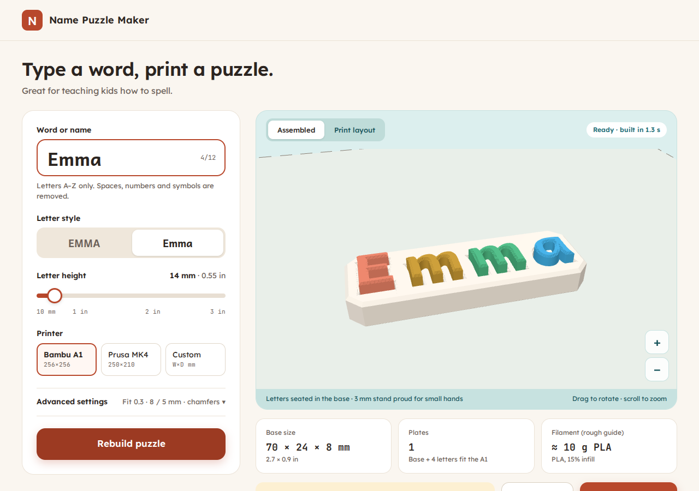

# Name Puzzle Maker

Type a child's name and download a print-ready STL of a **drop-in letter puzzle**: a base
tray with a pocket for each letter, plus the letters themselves, all laid flat on the
build plate. Made for the Bambu A1 (256 × 256 mm) and Prusa MK4 (250 × 210 mm), or any
custom bed, with a 0.4 mm nozzle and PLA.

Everything runs in the browser. OpenSCAD (the official WebAssembly build) renders the
model in a Web Worker. There is no server, no build step and no framework: just static files.



## How it works

1. **Layout in JavaScript** (`lib/layout.js`). The name is cleaned (A–Z only), cased, and
   laid out on one baseline using the font's advance widths. Gaps are then widened wherever
   two pocket openings would be closer than 3 mm. The base is sized so that every pocket
   opening sits exactly 2 mm from the edge of the base's flat top face. The glyph outlines
   come from OpenSCAD itself (`lib/glyphs.js`, made by `tools/build-glyphs.mjs`), and
   OpenSCAD's mitred `offset(delta=…)` is reproduced exactly, so the numbers match the
   real mesh to about 0.001 mm.
2. **Bed fit and plates.** Parts are packed in rows, 5 mm apart, inside the bed. If they
   don't all fit, the letters spill onto more plates. If the base is too long to lie
   straight (or across) the bed, it is **turned 45°** and gets a plate to itself, and the
   letters go on their own plate as a separate STL (`…-base.stl` and `…-letters.stl`, plus a
   ZIP). If the base doesn't fit even turned, the app says by how much and offers the
   tallest letter height that fits. It never makes a file that can't print.
3. **OpenSCAD source** (`lib/scad.js`). A readable `.scad` file with every parameter named
   at the top. You can download it and tweak it in desktop OpenSCAD.
4. **Render** (`worker.js`, `lib/build.js`). Each distinct letter and the base are rendered
   once with the Manifold backend. Copies are then placed on each plate and written out as
   binary STL (one per plate, plus a ZIP when there is more than one).
5. **Preview** (`lib/viewer.js`). three.js shows the Assembled and Print layout views with
   the bed underneath. Before you build, the preview is drawn live from the layout.

The dots on **i** and **j** are joined to their stems by a **5 mm wide** bar (`bridge_width`),
so every letter prints as one piece. The pocket, the letter spacing and the base are all sized
around that bar. The glyph tool checks every A–Z and a–z glyph for loose islands (in Andika
only i and j have any) and fails if any letter is still in pieces with the bar at 10 mm and
76.2 mm letter heights.

**Letter chamfers.** The top face of every letter has a 0.6 mm 45° chamfer and the bottom
face 0.4 mm (counters elephant's foot and eases the drop-in), cut as 0.1 mm steps. The part
that sits in the pocket keeps the exact outline the pocket was cut from.
Counters (the holes in a, b, d, e, g, o, p, q, A, B, D, O, P, Q, R) stay open in the letter.
The pocket stays solid there, leaving a post that helps the letter seat correctly.

## Parameters

All dimensions are in mm. Names match the generated `.scad`.

| Parameter | Default | Notes |
|---|---|---|
| `letter_height` | 14 | Slider 10–76.2 mm (0.4–3 in), step 0.2 mm. Cap height of capitals; lowercase letters keep the font's proportions. |
| `letter_thickness` | 8 | Advanced, 4–15. Always at least `pocket_depth + 1`. |
| `pocket_depth` | 5 | Advanced, 2–10. Letters stand `letter_thickness − pocket_depth` (3 mm) proud. |
| `base_floor` | 3 | Solid floor under the pockets, so `base_thickness` = 8. |
| `fit_clearance` | 0.3 | Advanced, 0.1–0.6, per side. Pocket = letter outline `offset(delta = fit_clearance)`. 0.2 snug, 0.3 slip fit, 0.4 loose. |
| `letter_chamfer` | 0.6 | Advanced, 0–1 (and at most 6% of the letter height). 45° chamfer around the top face of each letter. |
| `letter_bottom_chamfer` | 0.4 | 45° chamfer around the bottom face of each letter. |
| `bridge_width` | 5 | Width of the bar joining the dot of i and j to its stem. |
| `lead_in` | 0.5 | 45° chamfer around the top of each pocket, cut as 5 steps of 0.1 mm. |
| `side_margin` | 2 | Pocket opening (including the lead-in) to the edge of the base's flat top face, on all four sides. |
| `letter_gap` | 3 | Minimum wall between neighbouring pocket openings. |
| `corner_chamfer` | 4 | Advanced, 1–15. Vertical corner cut, 45° in plan view. |
| `corner_min_wall` | 1.2 | If a corner cut would leave less wall than this at a pocket, the base grows slightly in Y on that side. |
| `edge_chamfer` | 1 | Advanced. Base top perimeter edge. Capped below `side_margin − 0.8` (max 1.1), with a note. |
| `bottom_chamfer` | 0.4 | Bottom perimeter edge, counters elephant's foot. |
| `part_spacing` | 5 | Gap between parts on the build plate. |
| `bed_margin` | 3 | Parts stay this far inside the bed edges. |

**Font:** [Andika](https://software.sil.org/andika/) Bold by SIL International, designed for
beginning readers. It is bundled unmodified in `fonts/` under the SIL Open Font License 1.1
(`fonts/OFL.txt`). The interface uses Lexend and JetBrains Mono (both OFL, licenses in
`fonts/`). **Engine:** OpenSCAD 2025.03 WebAssembly, GPL-2.0-or-later; see
`vendor/openscad/README.md`. **Preview:** three.js 0.186.1 (MIT) from cdnjs, pinned with SRI.

## Run locally

```sh
python3 -m http.server 8000
# open http://localhost:8000/
```

The page must be served over HTTP (not opened as a file) because it uses ES modules and a
module Web Worker. You can link straight to a name: `http://localhost:8000/?name=Emma`.

## Run the tests

```sh
node --test                          # unit tests for lib/layout.js and lib/scad.js (no dependencies)
node tests/render.mjs                # renders real STLs into tests/output/ with the vendored wasm
pip install -r tests/requirements.txt
python3 tests/validate_stl.py        # watertight, Z = 0, inside bed, no overlaps, sizes, margins, walls
cd tests && python3 fit_check.py     # each pocket = its letter offset by the clearance; i/j are one piece, 5 mm bar, letter chamfers
```

If you change the font or the OpenSCAD build, regenerate the glyph data with
`node tools/build-glyphs.mjs`.

## Deploy on GitHub Pages

1. Push this folder to a repository named `name-puzzle-maker` on the `main` branch.
2. On GitHub: **Settings › Pages › Build and deployment › Source: Deploy from a branch**,
   then choose **Branch: `main`**, folder **`/ (root)`**, and **Save**.
3. After a minute the site is live at `https://YOUR-GITHUB-USER.github.io/name-puzzle-maker/`.
   All paths are relative, so it works from that sub-folder. The empty `.nojekyll` file stops
   Jekyll from processing the site.
4. Replace `YOUR-GITHUB-USER` in `index.html` (Open Graph tags and the footer link) with your
   user name or portfolio URL. To show the "Order here" link, put your order page in the
   footer's `#order-link` `href` and remove `hidden` from `#order-wrap`. The "nothing fits"
   message then offers "Order it printed" too.

## Before printing whole puzzles

Print **one letter and its pocket** first to check the fit on your printer and filament. If
it's tight, raise the fit clearance to 0.4 mm; if it rattles, try 0.2 mm. Letters are
toy-sized parts: for ages 3+ with adult supervision. Check every print for sharp edges or
stringing before giving it to a child.

## Files

```
index.html  styles.css  app.js  worker.js
lib/layout.js   name cleanup, params, spacing, margins, bed fit, plate packing (pure)
lib/scad.js     inputs + layout -> .scad source (pure)
lib/job.js      form inputs -> everything a build needs (pure)
lib/build.js    render pipeline shared by the worker and tests
lib/engine.js   OpenSCAD wasm runner
lib/glyphs.js   generated glyph outlines (tools/build-glyphs.mjs)
lib/stl.js  lib/zip.js  lib/viewer.js
fonts/  vendor/openscad/  tools/  tests/  docs/
```
